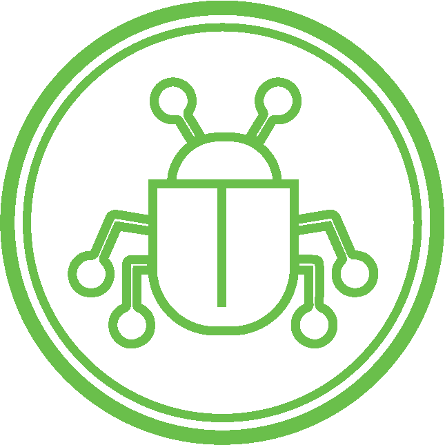

<h1 align="center">
  
</h1>

<h3 align="center">
  Cybersecurity Specialist & Full-Stack Developer
  
</h3>

  

  <h2>🚀 About Me</h2>
  
  🔭 Passionate about **Cybersecurity** and **Software Development**
  
  🌱 Currently exploring **Machine Learning** and **Natural Language Processing**
  
  💡 Open to collaborating on **Security** and **Full-Stack** projects
  
  💬 Ask me about:
  - 🛡️ Cybersecurity & Ethical Hacking
  - 🐧 Linux Systems
  - 🌐 Web Development
  - 🔧 DevOps & Automation

<h2 align="center">🛠️ Technology Stack</h2>

Click to Toggle

 

**Operating Systems & Tools**

  
  

**Frontend Development**

  

**Programming Languages**

  

**Backend Development**

  

**Design Tools**

  

<h2 align="center">🏆 Certifications & Achievements</h2>

  <h3>Cisco Certifications</h3>
  

    
    
    
    
    
  

  
  
  
  <h3>Security Specializations</h3>
  

    
    
    
    
  

<!--    -->
  

<h2 align="center">📊 GitHub Analytics</h2>
<!--

  
  

  

-->

<!-- Dracula Theme -->

  
  
  

<!-- Snake animation -->

